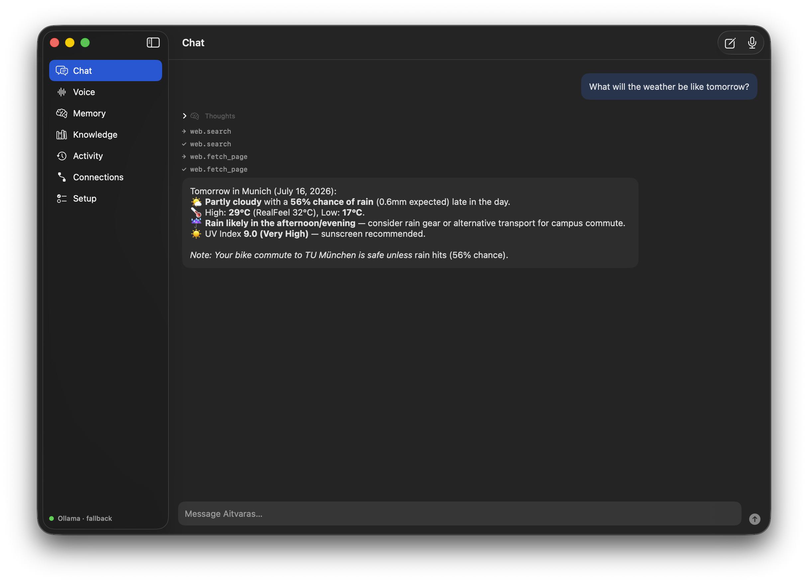
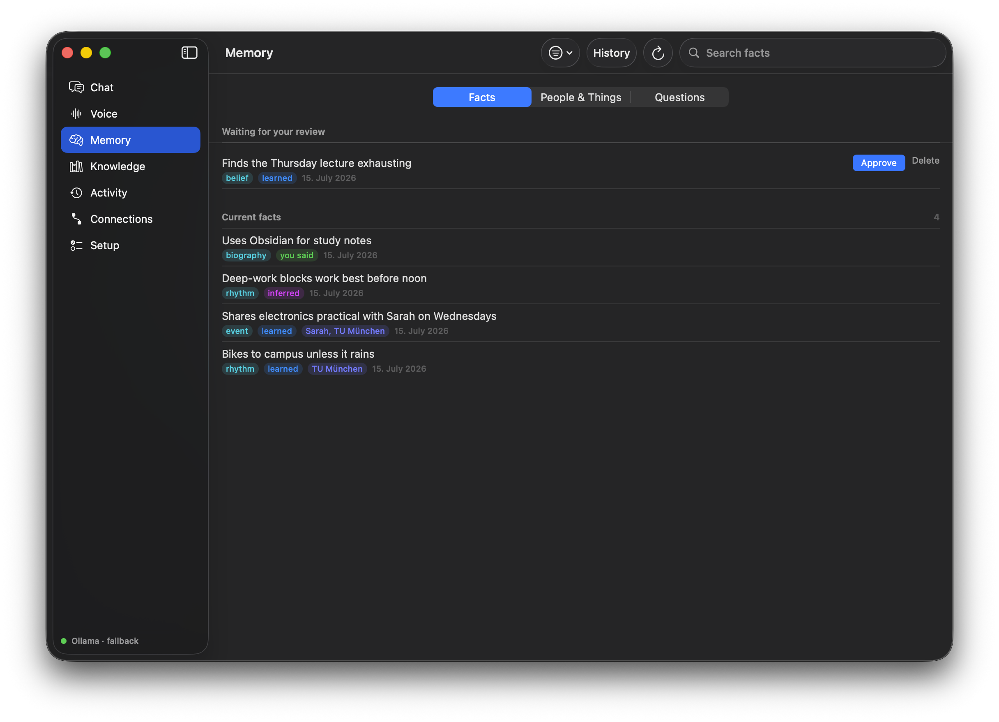
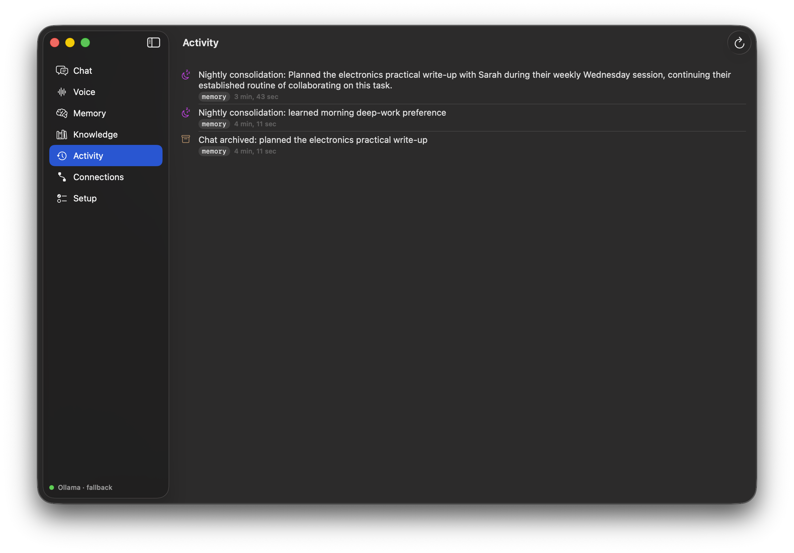
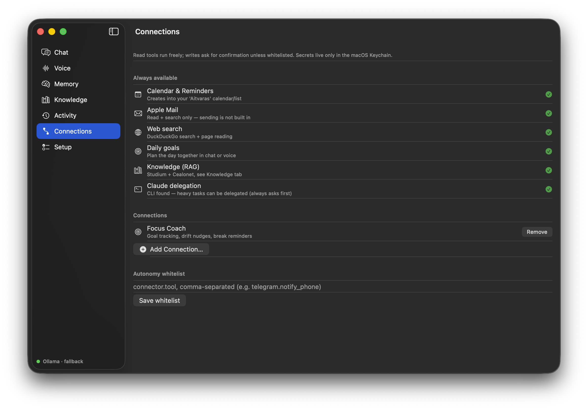
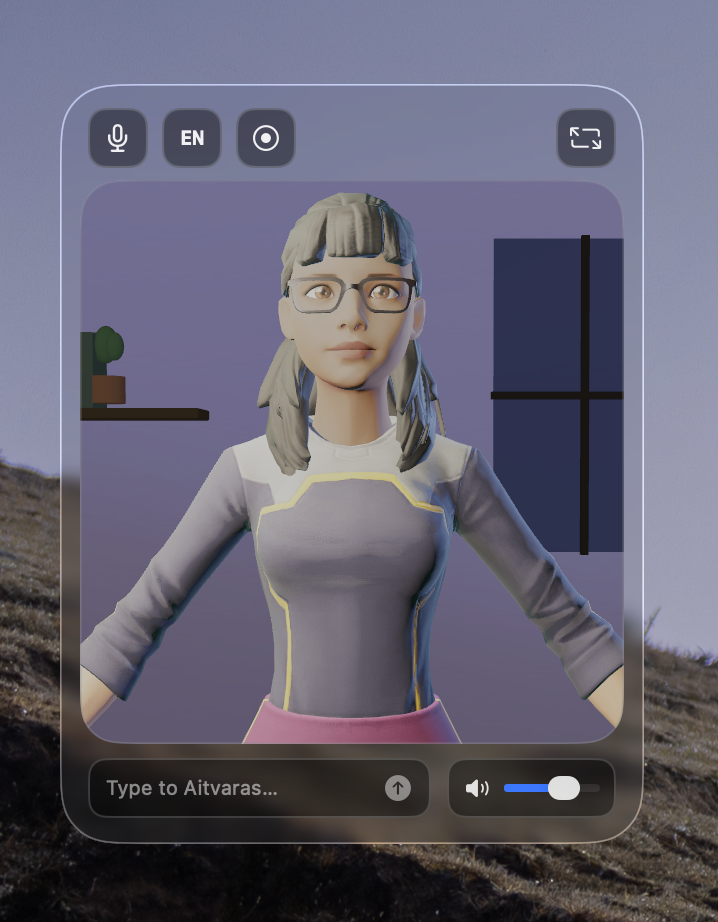
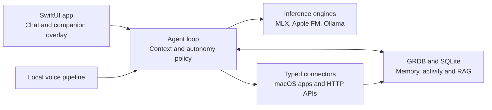

# Aitvaras

A local-first agentic AI assistant for macOS, with an animated 3D companion
character, high-quality bilingual (DE/EN) voice, structured long-term memory,
and deep integration into native macOS apps and personal infrastructure.

**Everything runs on-device** (Apple Silicon, MLX). No cloud LLM APIs. The
only network calls are the integrations you configure (your mail stays in
Mail.app, your notes stay on disk, your facts stay in a local SQLite file).

[Portfolio](https://leonardmo.com) · [Architecture](docs/ARCHITECTURE.md) ·
[Roadmap](docs/ROADMAP.md)

## Why I built this

I built Aitvaras after finding OpenClaw too operationally heavy for what I
wanted from a personal assistant. Instead of running a general-purpose gateway
and server stack, I wanted a focused local application that makes the computer
I already use smarter during everyday work.

The companion avatar is a deliberate part of that idea rather than decoration:
an always-available overlay makes interaction immediate, visible and more fun
than opening another chat tab.

> **Fun fact: why "Aitvaras"?** The name comes from the **aitvaras** of
> Lithuanian folklore: a small household dragon (often pictured as a fiery
> rooster-tailed serpent) that nests behind the hearth, the warmest spot in
> the house, and brings its keeper grain, milk and gold, provisioning the
> household from the world outside. A local AI that lives on the warm little
> server in the corner and carries data home is, functionally, the same
> creature. The name was also chosen for wake-word engineering reasons: 3–4
> syllables with a strong alveolar plosive /t/ and a distinct /ai/ diphthong
> make an acoustically robust, rarely-false-triggered activation word, and it
> does not collide with a common human name. The full
> naming research (phonetics, wake-word design, mythology; in German) lives
> in [docs/AITVARAS.md](docs/AITVARAS.md).

## What Aitvaras does

- **Companion character**: a stylized 3D figure in a floating always-on-top
  window (global hotkey ⌥Space), plus a full desktop app for chat, memory,
  activity and settings.
- **Voice**: hands-free conversation with barge-in; on-device STT
  (SpeechAnalyzer) and neural TTS (Chatterbox multilingual / Kokoro) in German
  and English, with instant Apple-voice fallback.
- **Memory that learns** (not a chat log): typed, entity-tagged facts with
  validity history (corrections supersede, never silently overwrite). Ending
  conversations are flushed into episode summaries + durable facts; a nightly
  consolidation pass reconciles the day against what's known, infers patterns,
  and writes a digest you can audit. Sensitive inferred facts are quarantined
  until you approve them. Everything is browsable and editable in the
  **Memory** view, including the questions Aitvaras would like to ask you.
- **Mail triage**: reads new mail across accounts (leaves it unread),
  classifies urgency locally, pushes truly urgent items to your phone via
  Telegram when you're away, and proposes actions (event, reminder) as
  one-tap cards. **Aitvaras cannot send email, by design.**
- **Calendar & Reminders**: creates events and todos via EventKit; only ever
  modifies items she created herself.
- **Knowledge (RAG)**: add any folders (notes vault, code repos); hybrid
  semantic + keyword search grounds answers in your actual material.
- **Moodle**: assignment deadlines and course events via the iCal export
  (built against TUM's Moodle, works with any instance that has calendar
  export enabled).
- **Homelab**: read-only status of Proxmox, TrueNAS and Home Assistant via
  their HTTP APIs (no SSH). Arbitrary HTTP APIs can be added from a JSON
  manifest without writing Swift.
- **Delegation**: hands oversized tasks to Claude Code / Codex CLI headlessly
  (your subscriptions, no API keys) and reports results back.
- **Autonomy with an audit trail**: every side effect passes a risk policy
  (read / reversible / needs-confirmation) and lands in the activity log with
  its full provenance chain ("event created ← suggestion accepted ← mail
  classified urgent ← mail received").

## Interface

The native app keeps chat, reviewable memory, activity provenance and
connections visible in one place.

| Chat | Memory |
| --- | --- |
| [](docs/images/aitvaras-chat.png) | [](docs/images/aitvaras-memory.png) |
| **Activity** | **Connections** |
| [](docs/images/aitvaras-activity.png) | [](docs/images/aitvaras-connections.png) |

### Floating companion

<p align="center">
  <a href="docs/images/aitvaras-companion.png">
    
  </a>
</p>

The long-term character direction is an original small dragon inspired by the
aitvaras of Lithuanian folklore. I am still developing that model; the current
dragon prototype did not yet meet the visual quality bar for the public
version. For now, the companion therefore falls back to
[`avatars/brunette.glb`](https://github.com/met4citizen/TalkingHead/blob/main/avatars/brunette.glb)
from Mika Suominen's MIT-licensed
[TalkingHead](https://github.com/met4citizen/TalkingHead) project. It is a
Ready Player Me-generated character with facial blendshapes that support
blinking, expressions and voice-driven lip sync. The source and third-party
license notice are preserved in
[`App/Resources/AVATAR-CREDITS.md`](App/Resources/AVATAR-CREDITS.md).

## Technical highlights

- **Native macOS architecture**: Swift 6 with strict concurrency, SwiftUI and
  AppKit for the application shell, and SceneKit for the animated companion.
- **Modular core**: separate SwiftPM modules for domain logic, inference,
  voice, storage, retrieval, connectors and the agent loop. Most functionality
  builds and tests independently of Xcode.
- **Local multi-model inference**: MLX runs tiered Qwen models in-process;
  Apple Foundation Models handles suitable lightweight tasks, with an optional
  localhost Ollama adapter behind the same inference protocol.
- **Full-duplex voice pipeline**: on-device Apple speech recognition,
  interruption and barge-in handling, neural speech synthesis through a local
  sidecar, plus an immediate system-voice fallback.
- **Inspectable long-term memory**: GRDB-backed SQLite storage with temporal
  facts, provenance, corrections, review queues, FTS5 keyword retrieval and
  optional vector search.
- **Typed integration boundary**: every connector exposes schema-defined
  tools with an explicit risk level. A central autonomy policy gates side
  effects before they reach Calendar, Reminders, Mail or external APIs.
- **Testable isolation**: deterministic model fakes and relocatable state
  profiles exercise memory, retrieval, connectors and migrations without
  touching real user data.

## Architecture at a glance



## Requirements

- Apple Silicon Mac, 32 GB+ RAM recommended for the default model set
- macOS 26+, Xcode 26+, [XcodeGen](https://github.com/yonaskolb/XcodeGen)
- Models in `~/Library/Application Support/Aitvaras/Models/`: Qwen3-30B-A3B-4bit
  and Qwen3-4B-4bit (MLX format; downloadable from Setup → Models)
- Optional: [Ollama](https://ollama.com) with `nomic-embed-text` for
  embeddings (keyword search works without it; embeddings backfill later)
- Optional: Python 3.11+ for the neural-voice sidecar (installed from Setup)

## Build & run

```sh
brew install xcodegen                 # once
./scripts/build-release.sh            # builds + installs /Applications/Aitvaras.app
```

Development:

```sh
swift test                            # core logic, no Xcode needed
xcodegen generate && open Aitvaras.xcodeproj    # scheme "Aitvaras"
```

First launch: work through **Setup** in the sidebar (permissions, models,
voice, connections). Nothing is preconfigured; integrations exist only after
you add them.

## Testing

See [docs/TESTING.md](docs/TESTING.md). Highlights: deterministic fakes for
model plumbing, an end-to-end-tested migration chain, and **isolated
profiles**: `AITVARAS_STATE_DIR=/tmp/x Aitvaras --seed-demo-state` boots the app
against a throwaway state tree seeded with a fictional persona, so live
testing (by you or an agent) never touches real memories.

```sh
./scripts/test-smoke.sh               # tests + app build + privacy sweep
```

## Documentation

- [docs/DECISIONS.md](docs/DECISIONS.md): every product/architecture decision, numbered, with rationale
- [docs/ARCHITECTURE.md](docs/ARCHITECTURE.md): module layout and data flow
- [docs/ROADMAP.md](docs/ROADMAP.md): milestone status
- [docs/MASTERPLAN.md](docs/MASTERPLAN.md): the forward plan: situational awareness + the learning loop
- [docs/research/](docs/research/): the evidence base (agent-memory survey, multi-model patterns, OpenClaw teardown)

## Privacy model

Local-first is the point, not a feature flag: inference on-device, state in
one SQLite file you own, secrets only in the macOS Keychain, mail read-only
by hard rule, and an activity log that can explain every action. The memory
system additionally quarantines sensitive inferred facts until approved and
keeps superseded facts as inspectable history instead of silently rewriting.

## Credits

- [MLX](https://github.com/ml-explore/mlx-swift) + [mlx-swift-lm](https://github.com/ml-explore/mlx-swift-lm): on-device inference
- [Qwen3](https://github.com/QwenLM/Qwen3): chat/voice/background models
- [GRDB](https://github.com/groue/GRDB.swift): SQLite persistence
- [GLTFKit2](https://github.com/warrenm/GLTFKit2): avatar loading
- Temporary companion avatar: TalkingHead's
  [`avatars/brunette.glb`](https://github.com/met4citizen/TalkingHead/blob/main/avatars/brunette.glb)
  (MIT), originally generated with Ready Player Me. An original Aitvaras
  dragon is planned.
- [Chatterbox](https://github.com/resemble-ai/chatterbox) & [Kokoro](https://huggingface.co/hexgrad/Kokoro-82M) (via [mlx-audio](https://github.com/Blaizzy/mlx-audio)): neural TTS

## License

This repository is source-available for portfolio and review purposes. No
license is granted; all rights are reserved.
